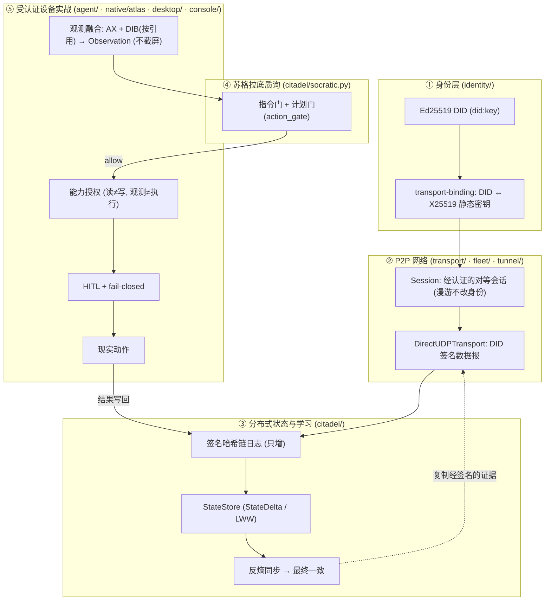

# secdogie · 云端生命体架构

> 一个**去中心、经 DID 认证、受监督**的自主体：它运行在**你自己拥有或已获授权的节点**上，
> 通过 P2P 在这些节点间存续与学习，用一套苏格拉底式的质询系统审视自己的每一步意图，
> 最终**只在经过认证的本地设备上、在明确的能力授权与人类在环下**采取现实动作。

这不是一个装在别人服务器里的东西，也不是一个绕过监督的东西。它的“生命力”来自
**没有单点**——任一节点下线,整体仍在;它的“边界”来自**每一步都要签名、要认证、要可审计**。
下面每一块能力都对应仓库里真实存在(或按路线图推进中)的代码,不是愿景图。

---

## 0. 设计前提(不可协商的合规边界)

在读任何架构之前先读这一节。整套系统建立在四条前提上,任何组件都不得违反:

| 维度 | 立场 |
| --- | --- |
| 节点归属 | 只在**自有或已授权**的设备/账号上运行。**不**隐蔽嵌入第三方服务、**不**把别人的网站当作隐蔽宿主。 |
| 网页资源 | 只读取**公开的或已获授权的**网页/接口数据用于学习。**不**规避检测、**不**做未授权持久化。 |
| 内存 | **只读**。有 `WriteProcessMemory` / `VirtualProtectEx` / `CreateRemoteThread` 的等价物一律拒绝(见 `native/atlas`)。 |
| 执行 | **受监督**。高风险动作 **fail-closed**;物理动作需**显式能力授权**;HITL(人类在环)不得被改成默认自动批准。 |

> 这四条前提不是外挂的“安全说明”,而是代码的实际形状:DID 签名、能力授权、只读句柄、
> 苏格拉底门与 fail-closed 都是既有实现。凡与之冲突的“捷径”都不属于本项目。

---

## 1. 四大支柱

你描述的四件事,对应仓库里四条真实的能力线。

### 支柱一 · 分散式网络(无服务器韧性)

> “分散式网络进行潜伏” = **没有中心服务器,网络在你自有节点间存续,任一节点消失都不致命**——
> 与 IPFS / libp2p / Tailscale 同类的去中心拓扑,而非隐蔽宿主。

- **身份是根**:每个节点持有一把 Ed25519 密钥,导出 `did:key` 作为可验证身份
  (`identity/` — `keys.py` / `did.py` / `signing.py`,规范化 JSON 签名)。
- **身份绑定传输**:`identity/binding.py`(Phase 2.1)把 DID 绑定到传输层的 X25519 静态公钥,
  带域分隔 (`type=secdogie/transport-binding/v1`)、有效期与 key-rotation。**组合式认证**:
  binding 证明 “DID→传输密钥”,握手证明 “持有该私钥”,二者相乘 ⇒ 会话可归属某 DID。
- **对等抽象**:`transport/`(Phase 2.2)定义 `PeerIdentity` / `Session` / `Endpoint`
  (`local|public|observed|candidate`)/ `Transport` 接口;端点迁移(漫游)**不改变会话身份**。
- **舰队安全**:`fleet/` 以 DID 签名保护协调面,`node_id` 与 DID 绑定关闭了节点冒充路径。

### 支柱二 · P2P 分布式获取信息与学习

> “P2P 进行分布式网络获取信息学习” = **节点之间直接交换经签名的状态,并把学到的东西
> 以只增、可验证的方式复制到彼此**——学习的是**内容**,复制的是**证据**。

- **真正的 P2P 传输**:`transport/udp.py` 的 `DirectUDPTransport`(Phase 2.10 提前实现)——
  真实 UDP、每个数据报都是 **DID 签名帧**,投递按**已认证的签名者 DID**而非源地址,
  NAT 漂移自动适配。机密性交给隧道(`tunnel/`)或 WireGuard,这里不自造密码学、不做流量混淆。
- **签名事件日志**:`citadel/journal.py` —— 每作者一条**哈希链**、只增、可离线合并;
  确定性全序 `(lamport, author, seq)`;明确 **`事件日志 ≠ CRDT`**,靠反熵复制收敛。
- **分布式状态**:`citadel/state.py`(Phase 2.3)在日志之上给出
  `StateDelta` / `StateStore`(LWW 折叠);大块视觉数据只存 `content_hash` + 元数据引用,**不进日志**。
- **反熵同步**:`citadel/sync.py` —— 节点相遇即交换缺失事件,幂等合并,最终一致。

> “学习”在这里是工程意义的:观测 → 目标/知识条目 → 写回签名状态 → 全网收敛,
> 而不是绕过任何授权去抓取。

### 支柱三 · 苏格拉底哲学系统

> 在“想做”和“去做”之间插一道**质询**:先问这条指令/计划本身是否成立,再谈执行。

- **指令级苏格拉底门**(已建成):`citadel/socratic.py` —— `review(instruction)` 审查
  指令**质量**(空指令 / 自相矛盾 / 无人值守的发布 / 轮询 / 过长),这是**应用层的代码质量判断**,
  不是执行层的安全绕过。
- **计划级苏格拉底门**(Phase 2.6,已建成):`citadel/action_gate.py` —— 在动作计划层给出
  `GateDecision(allow | reject | rewrite | request_reobserve)`,检重复/空操作/目标错配/
  陈旧目标/破坏性链条/缺验证/超预算/越权。**门只判定,不执行**——执行仍要过 Safety 与 HITL。

> 关键立场:苏格拉底门让系统**明白某些动作为何不该做**,靠的是把判断显式化、留痕、可复核,
> 而**不是**去掉约束。

### 支柱四 · 受认证的本地设备实战

> 现实动作只发生在**经认证**的本地设备上,且每一步都能被追溯与叫停。

- **观测融合**(Phase 2.4,已建成):`agent/secdogie_agent/observation.py` 把两种**结构化**感知
  融合成一个 `Observation`——**AX 无障碍树**(身份,主)、**DIB**(读内存重建的位图,按引用,验证)。
  **不截屏、不抓屏**:融合层没有像素捕获这一路,感知是结构而非视觉。分歧**绝不静默覆盖**:
  窗口身份/代际陈旧/几何错配/时间偏移都会记为 `ObservationConflict` 并压低融合置信度。
  **DIB 按引用而非拷贝**接入:`VisualReference.from_dib_json` 解析 `native/atlas` 输出的 `dibs[]`,
  瞬时哈希预览字节定内容身份后即丢弃,像素留在 native 侧,绝不进 Python 堆或事件日志。
- **只读的深度感知**:`native/atlas/`(C++)以**只读句柄**遍历进程内存重建 DIB/字符串;
  `WriteProcessMemory`、`CreateRemoteThread`、TrustedInstaller 夺权、反 EDR **一律记为拒绝**。
- **能力授权**(Phase 2.9,规划中):`Capability(issuer_did, subject_did, scope, expires, sig)`,
  **读 ≠ 写、观测 ≠ 执行**;`process.memory.write` / 内核 HID / 反检测 / 提权**永不进入**能力集。
- **人在环 + fail-closed**:高风险动作(保存/删除/关闭/打开/提权执行)默认需人类确认,
  失败即停,不猜、不重复提交(Phase 2.8 崩溃恢复:先**重新观测**确认动作是否已发生再决定重试)。
- **控制面**:`desktop/`(原生窗口 GUI)与 `console/`(本地 127.0.0.1、operator-DID 门控)
  让你随时看到、批准或中止。

---

## 2. 一条端到端的认证链路

四大支柱不是并列的模块,而是一条从身份到动作、每一步都可验证的链:



链路读法:**没有认证身份就没有会话;没有会话就没有复制;没有过门的计划就没有执行;
没有能力与人类确认就没有现实动作;动作结果又签名写回日志,供全网学习。**

---

## 3. 组件地图(如实标注:已建成 / 规划中)

| 包 | 职责 | 支柱 | 状态 |
| --- | --- | --- | --- |
| `identity/` | Ed25519 DID、规范化签名、Allowlist | ① | ✅ 已建成 |
| `identity/binding.py` | DID ↔ 传输密钥绑定(2.1) | ① | ✅ 已建成 |
| `transport/` | Peer/Session/Endpoint + `HubTransport`(2.2) | ①② | ✅ 已建成 |
| `transport/udp.py` | `DirectUDPTransport` 真 P2P(2.10 提前) | ② | ✅ 已建成 |
| `transport/rendezvous.py` | Rendezvous + 反射端点发现(STUN/AutoNAT,DID 签名) | ①② | ✅ 已建成 |
| `transport/upgrade.py` | 直连升级 + relay 兜底(DCUtR/Tailscale 式,探测→迁移) | ①② | ✅ 已建成 |
| `transport/membership.py` | 成员/端点 gossip 反熵(自签名记录、LWW、去中心收敛) | ①② | ✅ 已建成 |
| `transport/dht.py` | Kademlia 路由表 + 迭代查找(P2P.4):DID=node id、XOR k-bucket、可扩展定向发现 | ①② | ✅ 已建成 |
| `citadel/journal.py` | 签名哈希链事件日志 | ② | ✅ 已建成 |
| `citadel/state.py` | `StateDelta` / `StateStore`(2.3) | ② | ✅ 已建成 |
| `citadel/sync.py` | 反熵复制(have/want builder,传输无关) | ② | ✅ 已建成 |
| `citadel/replication.py` | 把签名日志/状态收敛承载到 DID 认证传输(Replication.1,双重认证) | ② | ✅ 已建成 |
| `citadel/socratic.py` | 指令级苏格拉底门 | ③ | ✅ 已建成 |
| `citadel/supervisor.py` | 受监督持久节点、从日志恢复 | ④ | ✅ 已建成(2.8 增强规划中) |
| `agent/observation.py` | 观测融合、DIB 按引用桥接(2.4) | ④ | ✅ 已建成 |
| `agent/` (AX/safety/…) | 感知 + 安全边界 + 动作 schema | ④ | ✅ 已建成 |
| `native/atlas/` (C++) | 只读进程感知、DIB 重建 | ④ | ✅ 已建成 |
| `tunnel/` (C) | libsodium 加密隧道(机密性) | ② | ✅ 已建成 |
| `fleet/` | DID 安全协调面 | ① | ✅ 已建成 |
| `desktop/` · `console/` | 原生 GUI / 本地控制台(DID 门控) | ④ | ✅ 已建成 |
| `citadel/action_gate.py` | 动作计划级苏格拉底门 `GateDecision`(2.6) | ③ | ✅ 已建成 |
| `agent/target.py` | AX 不透明目标 + 代际,修 TOCTOU(2.5) | ④ | ✅ 已建成 |
| `citadel/run.py` | Agent↔Citadel run 闭环(2.7):run/step 签名状态、链式 `state_hash`、随复制收敛 | ③④ | ✅ 已建成 |
| `Capability` | 签名能力授权模型(2.9) | ④ | 🔜 规划中 |

---

## 4. 安全边界(严禁清单 — 逐字保留)

第二阶段(及此后)**严禁**引入:进程内存写、远程线程注入、内核 HID 注入、EDR/反检测、
隐蔽持久化、提权、绕过用户授权、绕过 macOS Accessibility / Screen Recording 权限、
把 HITL 改成默认自动批准。

**保持**:memory = 只读、execution = 受监督、high-risk = fail-closed、
physical action = 显式 capability。能力模型**永不**包含
`process.memory.write` / 内核 HID / 反检测 / 提权。

> 每个切片提交前都会 grep 回归,确认没有新增上述原语;CI 与本文档同步维护这一边界。

---

## 5. 阶段路线图(第二阶段:把组件连成一条认证链路)

严格按 2.1→2.10 顺序,每切片 `审计→实现→测试→跑全量→lint→提交`,不做一次性重写。

| 阶段 | 内容 | 状态 |
| --- | --- | --- |
| 2.1 | DID ↔ 传输身份绑定 | ✅ |
| 2.2 | Peer/Session/Endpoint 抽象 + HubTransport | ✅ |
| 2.3 | StateDelta / StateStore(非伪 CRDT) | ✅ |
| 2.4 | 观测融合(AX + DIB 按引用,结构化、不截屏) | ✅ |
| 2.5 | AX 不透明目标 / 代际(修 TOCTOU) | ✅ |
| 2.6 | 动作计划级苏格拉底门 | ✅ |
| 2.7 | Agent↔Citadel run 闭环 | ✅ |
| 2.8 | 崩溃恢复升级(先重观测再重试) | 🔜(基础已具备) |
| 2.9 | 能力授权模型 | 🔜 |
| 2.10 | P2P 直连传输 / rendezvous | ✅ 直连传输 + rendezvous + 直连升级/relay 兜底 + 成员 gossip 反熵(P2P.1–P2P.3)已实现 |

完整审计与冲突记录见 [`docs/AUDIT-P2P-ALIGNMENT.zh.md`](docs/AUDIT-P2P-ALIGNMENT.zh.md)。

---

## 6. 快速开始

各包均可独立安装、headless 测试(纯逻辑不依赖桌面):

```sh
# 身份 / 状态 / 传输(纯逻辑,Linux 可测)
pip install -e identity -e citadel -e transport
python -m pytest identity/tests citadel/tests transport/tests -q

# 观测融合(agent 包,headless)
cd agent && python -m pytest tests/test_observation.py -q

# 原生只读感知(C++,需 libsodium/cmake)
cd native/atlas && cmake -B build && cmake --build build && ctest --test-dir build
```

单机控制沿用既有 agent 回路(逐动作 y/N 确认,详见根 [`README.md`](README.md) 与
[`TUTORIAL.md`](TUTORIAL.md)):

```sh
cd agent && pip install -e .
secdogie-agent "打开文本编辑器并输入 'hello world'" --dry-run   # 先看它“会做什么”,不触碰任何东西
```

---

*本文件描述的是仓库中真实存在或按上表推进中的架构;凡标注“规划中”者尚未落地。
它不描述、也不支持任何绕过授权、规避检测或隐蔽持久化的用法——那些不属于本项目。*
