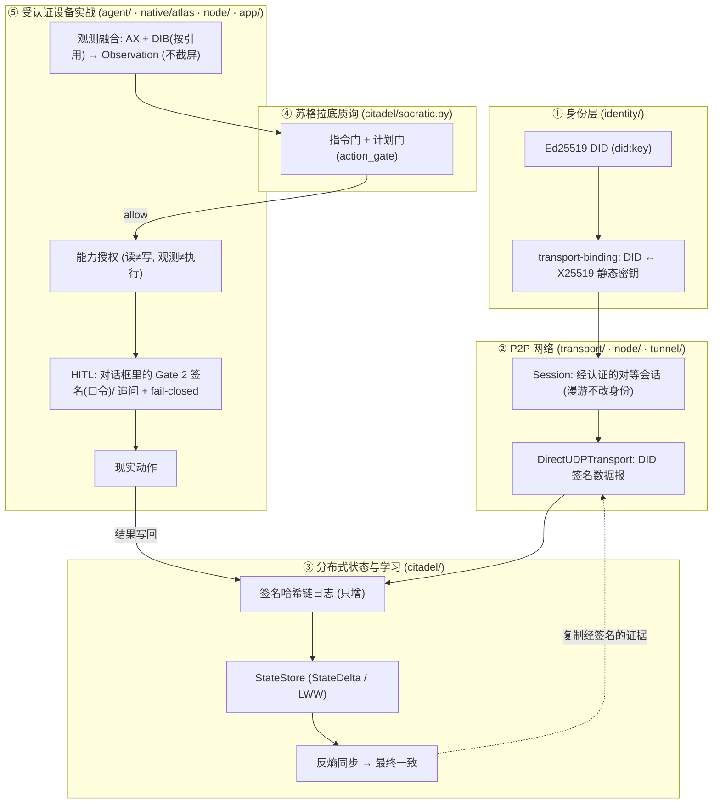

# secdogie · 云端生命体架构

> 一个**去中心、经 DID 认证、受监督**的自主体：它运行在**你自己拥有或已获授权的节点**上，
> 通过 P2P 在这些节点间存续与学习，用一套苏格拉底式的质询系统审视自己的每一步意图，
> 最终**只在经过认证的本地设备上、在明确的能力授权与人类在环下**采取现实动作。

这不是一个装在别人服务器里的东西，也不是一个绕过监督的东西。它的“生命力”来自
**没有单点**——任一节点下线,整体仍在;它的“边界”来自**每一步都要签名、要认证、要可审计**。
下面每一块能力都对应仓库里真实存在(或按路线图推进中)的代码,不是愿景图。

---

## 0. 设计前提(不可协商的合规边界)

在读任何架构之前先读这一节。整套系统建立在四条前提上,任何组件都不得违反:

| 维度 | 立场 |
| --- | --- |
| 节点归属 | 只在**自有或已授权**的设备/账号上运行。**不**隐蔽嵌入第三方服务、**不**把别人的网站当作隐蔽宿主。 |
| 网页资源 | 只读取**公开的或已获授权的**网页/接口数据用于学习。**不**规避检测、**不**做未授权持久化。 |
| 内存 | **只读**。有 `WriteProcessMemory` / `VirtualProtectEx` / `CreateRemoteThread` 的等价物一律拒绝(见 `native/atlas`)。 |
| 执行 | **受监督,且只在具身执行层**(物理带屏 UI 节点)。高风险动作 **fail-closed**,且在任何模式、任何入口都必须人工确认(没有开关可以关闭);物理动作需**显式能力授权**;HITL(人类在环)不得被改成默认自动批准。网络层与状态层不含 HITL;人的确认只落在具身执行层的高风险动作上(Gate 2 操作员签名即确认),见 0.1。 |

> 这四条前提不是外挂的“安全说明”,而是代码的实际形状:DID 签名、能力授权、只读句柄、
> 苏格拉底门与 fail-closed 都是既有实现。凡与之冲突的“捷径”都不属于本项目。

### 0.1 北极星:零信任自治网格,四层解耦

目标是一张**零信任的自治网格**:由你自有或已授权的无头节点与带屏节点共同构成,不以某台设备为中心,
也不依赖中心服务器。四层各自独立:

1. **网络层**:C + libsodium 加密隧道(`tunnel/`,机密性);跑在 Cloudflare Workers 上的
   WebRTC 信令网关(`webrtc/`,只交换 offer / answer / candidate,不经手业务数据);
   DID 认证的 UDP 直连(`transport/udp.py`,帧可选 X25519 密封);白名单中继
   (`transport/relay.py`,独立进程 `secdogie-relay`)——任何白名单节点都可以**全自动**充当 relay,
   打洞失败即回落中继,中继只转发端到端签名 / 密封的帧。
2. **Citadel 状态与鉴权层**:SQLite 签名哈希链 + 反熵;Ed25519 签名与 k-of-n 撤销。
   是否放行只看签名、白名单与撤销,去中心自治:`TrustPolicy` 与 allowlist 同为 `.contains` 接口,
   撤销即“白名单减去被撤销 DID”;各命令行都接受 `--masters` / `--revocations`,被撤销者处处被拒,
   自身被撤销的进程停下工作并以 0 退出。**零信任默认**:任何决定“听谁的”的组件在没给白名单时
   拒绝启动,“任何人”只能显式说出(代码里 `ALLOW_ANY`,命令行 `--insecure-dev`,带警告),
   见 [`docs/ZERO-TRUST-MIGRATION.md`](docs/ZERO-TRUST-MIGRATION.md)。**这一层没有人机交互或 HITL 阻塞**。
3. **双重苏格拉底门**:Gate 1 审视意图——指令门(`citadel/socratic.py`)与计划门
   (`citadel/action_gate.py`:意图契约、已知失败记忆、能力授权);Gate 2 要操作员签名——破坏性动作
   必须带操作员钥签发、绑定到这一个动作与这一个节点的授权令牌(`citadel/authz.py`),由 Dialogue App
   在操作员复核后签出(`dialogue/`)。阶段式记忆(S1 情节 → S2 隔离区 → S3 巩固)只喂给 Gate 1,
   只能让门更严;**Gate 2 从不读记忆**。
4. **具身执行层(只在物理带屏 UI 节点)**:AX 结构化感知、Atlas 只读(由机主维护)。
   **HITL 只锁在这一层的高风险动作上**(Gate 2 签名即该步的确认),不得阻塞前两层的无头运转。

**节点角色**:
- **无头基础设施节点**(VPS、NAS):承担 relay、membership gossip、日志复制。它们只看签名、白名单与撤销,
  无人值守、没有确认环节,也不运行具身执行层。`secdogie-relay` 就是这样一个进程:不读 stdin,
  不导入 agent / citadel / node,SIGTERM 时干净退出;给了 `--masters` 后,被撤销的 DID 立即停止被中转,
  而当这台 relay 自身的 DID 被合法撤销时,它像被机主停掉一样干净退出(`exit(0)`)。
- **带屏交互节点**:在前三层之上再运行具身执行层,高风险物理动作在这里经人工确认。
  `secdogie-node` 是这样一个常驻前台进程:组装传输、对话会话、签名日志与受监督的 agent 回路,
  只接受白名单内的 Dialogue App,没有 App 可达时需要操作员的步骤一律拒绝。
- **撤销即吊销授权**:Master 门限签名的撤销记录经 gossip 泛洪扩散,任一节点收到即拒绝被撤销 DID(静默丢弃),
  被撤销的节点收到针对自身的记录即自停机。这是授权吊销的正常收尾,不是隐蔽或对抗行为。
- 第 4 节的严禁清单对全系统有效,无论节点是否无头。

---

## 1. 四大支柱

你描述的四件事,对应仓库里四条真实的能力线。

### 支柱一 · 分散式网络(无服务器韧性)

> “分散式网络进行潜伏” = **没有中心服务器,网络在你自有节点间存续,任一节点消失都不致命**——
> 与 IPFS / libp2p / Tailscale 同类的去中心拓扑,而非隐蔽宿主。

- **身份是根**:每个节点持有一把 Ed25519 密钥,导出 `did:key` 作为可验证身份
  (`identity/` — `keys.py` / `did.py` / `signing.py`,规范化 JSON 签名)。
- **身份绑定传输**:`identity/binding.py`(Phase 2.1)把 DID 绑定到传输层的 X25519 静态公钥,
  带域分隔 (`type=secdogie/transport-binding/v1`)、有效期与 key-rotation。**组合式认证**:
  binding 证明 “DID→传输密钥”,握手证明 “持有该私钥”,二者相乘 ⇒ 会话可归属某 DID。
- **对等抽象**:`transport/`(Phase 2.2)定义 `PeerIdentity` / `Session` / `Endpoint`
  (`local|public|observed|candidate`)/ `Transport` 接口;端点迁移(漫游)**不改变会话身份**。
- **节点与操作员**:每台机器跑 `secdogie-node`;操作员的对话框凭节点的自签就绪行配对,会话只信那一个 DID(第四阶段取代了 `fleet/` 协调面)。

### 支柱二 · P2P 分布式获取信息与学习

> “P2P 进行分布式网络获取信息学习” = **节点之间直接交换经签名的状态,并把学到的东西
> 以只增、可验证的方式复制到彼此**——学习的是**内容**,复制的是**证据**。

- **真正的 P2P 传输**:`transport/udp.py` 的 `DirectUDPTransport`(Phase 2.10 提前实现)——
  真实 UDP、每个数据报都是 **DID 签名帧**,投递按**已认证的签名者 DID**而非源地址,
  NAT 漂移自动适配。机密性:帧可选用绑定的 X25519 传输密钥密封(`transport/sealed.py`,libsodium),
  整机数据面走 C + libsodium 隧道(`tunnel/`);不自造密码学、不做流量混淆。
- **签名事件日志**:`citadel/journal.py` —— 每作者一条**哈希链**、只增、可离线合并;
  确定性全序 `(lamport, author, seq)`;明确 **`事件日志 ≠ CRDT`**,靠反熵复制收敛。
- **分布式状态**:`citadel/state.py`(Phase 2.3)在日志之上给出
  `StateDelta` / `StateStore`(LWW 折叠);大块视觉数据只存 `content_hash` + 元数据引用,**不进日志**。
- **反熵同步**:`citadel/sync.py` —— 节点相遇即交换缺失事件,幂等合并,最终一致。

> “学习”在这里是工程意义的:观测 → 目标/知识条目 → 写回签名状态 → 全网收敛,
> 而不是绕过任何授权去抓取。

### 支柱三 · 苏格拉底哲学系统

> 在“想做”和“去做”之间插一道**质询**:先问这条指令/计划本身是否成立,再谈执行。

- **指令级苏格拉底门**(已建成):`citadel/socratic.py` —— `review(instruction)` 审查
  指令**质量**(空指令 / 自相矛盾 / 无人值守的发布 / 轮询 / 过长),这是**应用层的代码质量判断**,
  不是执行层的安全绕过。
- **计划级苏格拉底门**(Phase 2.6,已建成):`citadel/action_gate.py` —— 在动作计划层给出
  `GateDecision(allow | reject | rewrite | request_reobserve)`,检重复/空操作/目标错配/
  陈旧目标/破坏性链条/缺验证/超预算/越权。**门只判定,不执行**——执行仍要过 Safety 与 HITL。
- **意图契约与已知失败**(第二阶段,已建成、已接入实时回路):破坏性一步必须说明回退办法或明确声明不可逆,
  否则被拒;同一动作在多次运行中反复失败,巩固为“已知失败”,下一次运行由计划门直接拒绝
  (`citadel/loop_gate.py`、`loop_memory.py`)。每一步都记下 `action_key` 与结果。
- **Gate 2 · 操作员签名**(已建成、已接入):破坏性一步向操作员的 Dialogue App 发出挑战;App 在本地
  重算动作哈希、核对节点身份与时效后,才解锁操作员钥签一次;节点验证令牌后放行,签名即这一步的确认。
- **阶段式记忆**(第二阶段,已建成):S1 情节(日志投影)→ S2 本地隔离区(模型的 `remember` 只进这里)→
  S3 巩固记忆(签名事件)。“小心”类记忆凭证据晋升;事实 / 偏好必须经操作员在 App 上签名确认才进 S3 与提示词。
  详见 [`citadel/MEMORY.zh.md`](citadel/MEMORY.zh.md)。

> 关键立场:苏格拉底门让系统**明白某些动作为何不该做**,靠的是把判断显式化、留痕、可复核,
> 而**不是**去掉约束。

### 支柱四 · 受认证的本地设备实战

> 现实动作只发生在**经认证**的本地设备上,且每一步都能被追溯与叫停。

- **观测融合**(Phase 2.4,已建成):`agent/secdogie_agent/observation.py` 把两种**结构化**感知
  融合成一个 `Observation`——**AX 无障碍树**(身份,主)、**DIB**(读内存重建的位图,按引用,验证)。
  **不截屏、不抓屏**:融合层没有像素捕获这一路,感知是结构而非视觉。分歧**绝不静默覆盖**:
  窗口身份/代际陈旧/几何错配/时间偏移都会记为 `ObservationConflict` 并压低融合置信度。
  **DIB 按引用而非拷贝**接入:`VisualReference.from_dib_json` 解析 `native/atlas` 输出的 `dibs[]`,
  瞬时哈希预览字节定内容身份后即丢弃,像素留在 native 侧,绝不进 Python 堆或事件日志。
- **只读的深度感知**:`native/atlas/`(C++)以**只读句柄**遍历进程内存重建 DIB/字符串;
  `WriteProcessMemory`、`CreateRemoteThread`、TrustedInstaller 夺权、反 EDR **一律记为拒绝**。
- **能力授权**(Phase 2.9,已建成):`identity/secdogie_identity/capability.py`——受信 issuer(操作员 DID)
  给 subject(节点 DID)签发**带过期时间**的签名授权(默认 1 天)。**白名单制**:只有 `GRANTABLE_SCOPES`
  里的 scope 能被签发、验证、匹配,其余一律拒绝(含提权启动 `process.run_elevated`);**读 ≠ 写、观测 ≠ 执行**,
  精确匹配、无通配。验证必须给出受信 issuer 列表(无「接受任意签名者」模式)。计划门 `action_gate`
  在 `enforce_capabilities` 开启时据此逐动作校验:未授权 / 无 scope 映射的变更类动作一律拒绝。
- **人在环 + fail-closed**:高风险动作(保存/删除/关闭/打开/提权执行)默认需人类确认,
  失败即停,不猜、不重复提交(Phase 2.8 崩溃恢复:先**重新观测**确认动作是否已发生再决定重试)。
- **操作界面:一个对话框**(第四阶段):`app/`(`secdogie`,双击 exe 即打开)是**唯一**的操作界面——
  一个原生对话框加 API key 填写。它在一个窗口里承载 Dialogue App(`dialogue/` 的 `AppController`)的全部:
  苏格拉底追问与回答、结构化视界(折叠区;只有 AX 结构与 DIB 尺寸 / 哈希,没有像素)、Gate 2 审批
  (操作员私钥以口令加密,第一次审批时设口令,每次批准只解锁签一次)、记忆确认、停止;
  本机节点在同一进程里只绑 127.0.0.1,其他机器的节点配对后在同一窗口切换。它不截屏、不读进程内存、
  不依赖中心服务器。启动菜单卡片、终端界面、`desktop/`、`console/`、`fleet/` 已退役
  (见 [`docs/ONE-WINDOW-MIGRATION.md`](docs/ONE-WINDOW-MIGRATION.md))。

---

## 2. 一条端到端的认证链路

四大支柱不是并列的模块,而是一条从身份到动作、每一步都可验证的链:


```mermaid
flowchart TB
    subgraph ID["① 身份层 (identity/)"]
        did["Ed25519 DID (did:key)"]
        bind["transport-binding: DID ↔ X25519 静态密钥"]
        did --> bind
    end
    subgraph NET["② P2P 网络 (transport/ · node/ · tunnel/)"]
        sess["Session: 经认证的对等会话 (漫游不改身份)"]
        direct["DirectUDPTransport: DID 签名数据报"]
        bind --> sess --> direct
    end
    subgraph STATE["③ 分布式状态与学习 (citadel/)"]
        jrnl["签名哈希链日志 (只增)"]
        store["StateStore (StateDelta / LWW)"]
        sync["反熵同步 → 最终一致"]
        direct --> jrnl --> store --> sync
        sync -.->|复制经签名的证据| direct
    end
    subgraph MIND["④ 苏格拉底质询 (citadel/socratic.py)"]
        gate["指令门 + 计划门(action_gate)"]
    end
    subgraph ACT["⑤ 受认证设备实战 (agent/ · native/atlas · node/ · app/)"]
        obs["观测融合: AX + DIB(按引用) → Observation (不截屏)"]
        cap["能力授权 (读≠写, 观测≠执行)"]
        hitl["HITL: 对话框里的 Gate 2 签名(口令)/ 追问 + fail-closed"]
        obs --> gate
        gate -->|allow| cap --> hitl --> world["现实动作"]
        world -->|结果写回| jrnl
    end
```

链路读法:**没有认证身份就没有会话;没有会话就没有复制;没有过门的计划就没有执行;
没有能力与人类确认就没有现实动作;动作结果又签名写回日志,供全网学习。**

---

## 3. 组件地图(如实标注:已建成 / 规划中)

| 包 | 职责 | 支柱 | 状态 |
| --- | --- | --- | --- |
| `identity/` | Ed25519 DID、规范化签名、Allowlist | ① | ✅ 已建成 |
| `identity/binding.py` | DID ↔ 传输密钥绑定(2.1) | ① | ✅ 已建成 |
| `transport/` | Peer/Session/Endpoint + `HubTransport`(2.2) | ①② | ✅ 已建成 |
| `transport/udp.py` | `DirectUDPTransport` 真 P2P(2.10 提前);漫游只认新鲜且最新的认证帧,重放与迟到帧都改不了端点,中继帧从不改端点 | ② | ✅ 已建成 |
| `transport/rendezvous.py` | Rendezvous + 反射端点发现(STUN/AutoNAT,DID 签名);经 UDP 承载(`RendezvousService` / `RendezvousLink`,T3):请求须新鲜(时钟窗口内、每个 DID 单调)、回复回显请求且只收一次、登记过期、按 DID 限速;App 凭节点 DID 即可连上 | ①② | ✅ 已建成 |
| `transport/upgrade.py` | 直连升级 + relay 兜底(DCUtR/Tailscale 式,探测→迁移) | ①② | ✅ 已建成 |
| `transport/membership.py` | 成员/端点 gossip 反熵(自签名记录、LWW、去中心收敛);记录可带自签名的设备类别 `display` / `headless`(T7) | ①② | ✅ 已建成 |
| `transport/gossip.py` | 线上成员 gossip(T4):走 `ChannelMux` 的 `membership/v1` 通道,只应答网格节点,digest 先校验、记录按数据报分批,一轮交换有界;一条引导记录即可学到全网 | ①② | ✅ 已建成 |
| `transport/dht.py` | Kademlia 路由表 + 迭代查找(P2P.4):DID=node id、XOR k-bucket、可扩展定向发现 | ①② | ✅ 已建成 |
| `transport/relay.py` | Relay 角色化(2C):任一白名单节点可兼任 relay,经 membership 发现、租约 + 故障切换;只转发端到端签名/封装帧,每次转发重查 allowlist | ①② | ✅ 已建成 |
| `transport/relay_node.py` | 无头 relay 进程(2C.1):`secdogie-relay` 在 VPS / NAS 上无人值守运行,输出自签名引导记录,SIGTERM 干净退出 | ①② | ✅ 已建成 |
| `citadel/journal.py` | 签名哈希链事件日志 | ② | ✅ 已建成 |
| `citadel/state.py` | `StateDelta` / `StateStore`(2.3) | ② | ✅ 已建成 |
| `citadel/sync.py` | 反熵复制(have/want builder,传输无关) | ② | ✅ 已建成 |
| `citadel/replication.py` | 把签名日志/状态收敛承载到 DID 认证传输(Replication.1,双重认证);按数据报大小分批、作者轮转、有进展才续拉 | ② | ✅ 已建成 |
| `citadel/revocations.py` | 撤销记录写进日志(T6),随复制传播,离线节点回来即补上 | ①② | ✅ 已建成 |
| `citadel/socratic.py` | 指令级苏格拉底门 | ③ | ✅ 已建成 |
| `citadel/supervisor.py` | 受监督持久节点、从日志恢复(含 `recover_runs()` 2.8);执行投影(目标、控制、尝试、run 恢复)只读本节点自己的事件,对端的目标经复制到达但从不在本机运行 | ④ | ✅ 已建成 |
| `citadel/recovery.py` | 崩溃恢复决策(2.8):发现半途 run，executing 崩溃**先重观测再重试** | ③④ | ✅ 已建成 |
| `agent/observation.py` | 观测融合、DIB 按引用桥接(2.4) | ④ | ✅ 已建成 |
| `agent/` (AX/safety/…) | 感知 + 安全边界 + 动作 schema | ④ | ✅ 已建成 |
| `native/atlas/` (C++) | 只读进程感知、DIB 重建 | ④ | ✅ 已建成 |
| `tunnel/` (C) | libsodium 加密隧道(机密性) | ② | ✅ 已建成 |
| `app/` | **唯一的操作界面**:一个原生对话框 + API key;本机节点在进程内;视界折叠区;配对并切换到其他机器的节点(第四阶段) | ④ | ✅ 已建成 |
| `agent/secdogie_agent/websession.py` | 复用已授权浏览器会话,只读导航 + 读结构(可选 `[web]`) | ④ | ✅ 已建成(尚未接入回路) |
| `citadel/action_gate.py` | 动作计划级苏格拉底门 `GateDecision`(2.6) | ③ | ✅ 已建成 |
| `agent/target.py` | AX 不透明目标 + 代际,修 TOCTOU(2.5) | ④ | ✅ 已建成 |
| `citadel/run.py` | Agent↔Citadel run 闭环(2.7):run/step 签名状态、链式 `state_hash`、随复制收敛 | ③④ | ✅ 已建成 |
| `identity/capability.py` | 签名能力授权(2.9):白名单 scope、带过期、受信 issuer;计划门据此逐动作校验 | ④ | ✅ 已建成 |
| `identity/allowlist.py` | 零信任默认:`ALLOW_ANY` 显式哨兵 + `require_trust`;全仓生产调用点的信任参数有测试把关;`AnyOf` 合并多个信任集合、实时生效 | ① | ✅ 已建成 |
| `webrtc/` | Cloudflare Workers 上的 WebRTC 信令网关 + 浏览器数据通道(只经手信令,不经手业务数据);保留、不再扩展,没有网页操作界面 | ② | ✅ 已建成 |
| `transport/mux.py` | `ChannelMux`:一个传输上的多条应用通道(`dialogue/v1` 等) | ② | ✅ 已建成 |
| `transport/failover.py` | 直连优先、中继兜底:近期直接听到对端才只走直连,否则同时经双方都持有租约的中继发送;由中继自签名记录构建 | ② | ✅ 已建成 |
| `citadel/authz.py` | Gate 2 操作员授权令牌:绑定动作哈希与节点 DID、短时效 | ③④ | ✅ 已建成 |
| `citadel/loop_gate.py` · `loop_memory.py` | 两道门接入实时 agent 回路;每步记录 `action_key` / 结果 | ③④ | ✅ 已建成 |
| `citadel/episodes.py` · `lessons.py` · `consolidate.py` | 阶段式记忆 S1 / S2 / S3 | ③ | ✅ 已建成 |
| `dialogue/` | Dialogue App 的内核:签名信封协议、丢包 / 乱序下的会话层、节点侧桥接、控制器、唯一的会话接线 `connect.open_session`、无头脚本、结构化视界发布 | ③④ | ✅ 已建成 |
| `node/` | `secdogie-node` 常驻节点:组装传输、对话、签名日志与受监督回路;网格(第三阶段):rendezvous 登记、成员 gossip、日志复制、撤销经日志持久传播、无头节点;真实 UDP 端到端测试(单进程、三进程、五进程网格) | 全部 | ✅ 已建成 |

---

## 4. 安全边界(严禁清单 — 逐字保留)

第二阶段(及此后)**严禁**引入:进程内存写、远程线程注入、内核 HID 注入、EDR/反检测、
隐蔽持久化、提权、绕过用户授权、绕过 macOS Accessibility / Screen Recording 权限、
把 HITL 改成默认自动批准、隐蔽嵌入第三方服务、流量混淆、打洞式反检测。

**保持**:memory = 只读、execution = 受监督、high-risk = fail-closed 且在任何模式、
任何入口都必须人工确认(没有开关可以关闭)、physical action = 显式 capability。能力模型**永不**包含
`process.memory.write` / 内核 HID / 反检测 / 提权。

> 每个切片提交前都会 grep 回归,确认没有新增上述原语;CI 与本文档同步维护这一边界。

---

## 5. 阶段路线图(第二阶段:把组件连成一条认证链路)

严格按 2.1→2.10 顺序,每切片 `审计→实现→测试→跑全量→lint→提交`,不做一次性重写。

| 阶段 | 内容 | 状态 |
| --- | --- | --- |
| 2.1 | DID ↔ 传输身份绑定 | ✅ |
| 2.2 | Peer/Session/Endpoint 抽象 + HubTransport | ✅ |
| 2.3 | StateDelta / StateStore(非伪 CRDT) | ✅ |
| 2.4 | 观测融合(AX + DIB 按引用,结构化、不截屏) | ✅ |
| 2.5 | AX 不透明目标 / 代际(修 TOCTOU) | ✅ |
| 2.6 | 动作计划级苏格拉底门 | ✅ |
| 2.7 | Agent↔Citadel run 闭环 | ✅ |
| 2.8 | 崩溃恢复升级(先重观测再重试) | ✅ |
| 2.9 | 能力授权模型 | ✅ |
| 2.10 | P2P 直连传输 / rendezvous | ✅ 直连传输 + rendezvous + 直连升级/relay 兜底 + 成员 gossip 反熵(P2P.1–P2P.3)已实现 |
| 2C | 节点角色泛化(relay / rendezvous) | ✅ 任一白名单节点可兼任 relay(`relay.py`);`secdogie-relay --rendezvous` 在同一 socket 上兼任 rendezvous(第三阶段 T3) |

完整审计与冲突记录见 [`docs/AUDIT-P2P-ALIGNMENT.zh.md`](docs/AUDIT-P2P-ALIGNMENT.zh.md)(历史记录,照原样保留)。

### 第二阶段收口:可运行闭环(✅ 已完成)

| 波次 | 内容 | PR |
| --- | --- | --- |
| P0 | Gate 1 意图契约 + 阶段式记忆 S1–S3 | #56 |
| A | 记忆与两道门接入实时 agent 回路;模型的 `remember` 进隔离区 | #57 |
| C | Dialogue 协议修订、`ChannelMux`、会话层、节点侧桥接、App(控制器 / Textual / 无头)、结构化视界发布 | #60 |
| B | 零信任默认(破坏性变更,见迁移说明) | #61 |
| D | `secdogie-node`、对话路径的中继兜底、真实 UDP 端到端测试(进程内 + 三进程) | #62 |
| E | 文档对齐 | #63 |

端到端判据(`node/tests/test_e2e.py` 进程内;`node/tests/test_multiprocess.py` 三进程——`secdogie-relay`、节点、App 各自独立进程,App 拿到的是节点的无效地址,全程经中继;均在 CI 中运行):App 提交目标 → 破坏性一步经 Gate 2 由操作员签名放行 →
`ask_user` 成为追问、回答回到模型 → 模型的笔记在 App 确认前只在隔离区、确认后进入 S3 与提示词 →
App 看到结构化视界 → 同一动作三次失败后第四次被 Gate 1 拒绝。

### 第三阶段收口:多节点网格(✅ 已完成)

| 波次 | 内容 | PR |
| --- | --- | --- |
| F | T3:rendezvous 经 UDP 承载;请求新鲜性、回复回显、登记过期、限速;`secdogie-relay --rendezvous`;节点登记,App 凭 DID 连接 | #64 |
| G | T4:线上成员 gossip;日志复制(分批、作者轮转、有损链路上收敛);Supervisor 只运行本节点的目标;`--mesh` 必填 | #65 |
| H | T6:撤销经日志持久传播,离线节点回来补上,被撤销的节点敲门时被告知并停机;T7:设备类别,无头节点不接目标、从不加载 agent | #66 |
| I / J | 五进程网格端到端测试 + 文档 | 本 PR |

端到端判据(`node/tests/test_mesh_multiprocess.py`,五类进程——`secdogie-relay --rendezvous`、带屏节点 A 与 B、无头节点 H、App——在 CI 中运行;B 与 H 只凭 A 的就绪行启动,其余经 gossip 找到;App 只拿到节点 DID 与 rendezvous 记录):
同一次点击在 A 上三次失败 → A 的日志复制到 B → B 在从未失败过的情况下,第一个目标就被 Gate 1 以 `known-failure` 拒绝 →
向无头节点 H 派目标被拒 → B 停机期间,运营者经 A 的撤销库撤销 H:A 验证、写进日志并泛洪,H 得知自己被撤销后干净退出 →
B 带着旧日志回来,从 A 的日志补上它错过的撤销。进程内的同类测试见 `node/tests/test_mesh.py`、`test_revocation_mesh.py`。

### 第四阶段收口:收敛为一个对话框(✅ 已完成)

| 波次 | 内容 | PR |
| --- | --- | --- |
| K | `app/`:一个原生对话框;本机节点在进程内;首次审批时设口令,操作员钥只以加密形式存在;issuer 钥只在内存、只授桌面能力 | #68 |
| K2 | 视界折叠区;同一窗口配对并切换到其他机器的节点;会话接线合一(`dialogue.connect.open_session`) | #69 |
| L | 双击 exe 只打开对话框;窗口与节点打进同一个可执行文件;`release.yml` 的 Xvfb 冒烟 | #70 |
| M / N | 退役启动菜单卡片、终端界面、`desktop/`、`console/`、`fleet/`;迁移说明;文档 | 本 PR |

退出条件(逐条):
1. **单一入口**:双击 exe(或 `secdogie`)只打开一个原生对话窗口;其余入口已删除。
2. **首次只问 API key**:其余配置(节点钥、App 会话钥、白名单、能力授权)自动生成。
3. **一个窗口里完成全部协同**:目标、追问卡、审批卡(口令)、记忆卡、停止、改 key、视界折叠区、切换到其他机器的节点。
4. **安全不变**:操作员私钥只以口令加密存在,签一次即丢,口令不落盘;高风险在任何节点、任何入口都必须人工确认;
   Gate 2 不读记忆;零信任白名单一个不少;不截图、无 Web 端。
5. **后端**:现有 `secdogie-node` + `AppController`,本机节点只绑 127.0.0.1;远程节点走现有 DID 传输 / rendezvous / 中继;
   CLI、本机、远程共用一套会话接线。
6. **可测**:窗口逻辑在纯视图模型里;`app/tests/test_flow.py`(本机端到端:首次审批设口令 → 签名 → 执行 → 追问 →
   记住笔记 → 已知失败被拒 → 重开窗口,错口令不签)与 `app/tests/test_remote.py`(另一台机器上的节点:从本窗口批准后在那边执行;
   经 rendezvous 凭 DID 找到;不信任本操作员的节点什么都不执行)在 CI 中运行,Tk 视图测试在 Xvfb 下运行。
7. **打包与文档**:`release.yml` 干跑四个平台全绿,Linux 二进制在 Xvfb 下冒烟通过;README / ROADMAP / 本文 / SECURITY /
   迁移说明已更新。

### 第五阶段(规划中:加固)

| 编号 | 内容 |
| --- | --- |
| T9 | C Tunnel 加固:v2 握手(Noise IK)、rekey、端到端中继、本地控制 socket |
| M5 | 实机验证(macOS / Windows)、安全复审、发布 |

浏览器端(原 W 轨道)已从路线图删除:操作界面只有一个原生对话框。

感知层(AX / Atlas / DIB)由机主维护,不在本路线图的改动范围内。

---

## 6. 快速开始

各包均可独立安装、headless 测试(纯逻辑不依赖桌面):

```sh
# 身份 / 状态 / 传输(纯逻辑,Linux 可测)
pip install -e identity -e citadel -e transport
python -m pytest identity/tests citadel/tests transport/tests -q

# Dialogue App 内核、常驻节点与对话框(含真实 UDP 端到端测试;Tk 视图在 Xvfb 下)
pip install -e agent -e 'dialogue[net]' -e node -e app
python -m pytest dialogue/tests node/tests -q
xvfb-run -a python -m pytest app/tests -q

# 观测融合(agent 包,headless)
cd agent && python -m pytest tests/test_observation.py -q

# 原生只读感知(C++,需 libsodium/cmake)
cd native/atlas && cmake -B build && cmake --build build && ctest --test-dir build
```

日常使用:双击 exe,或运行 `secdogie`——只打开一个对话框(见 [`app/README.md`](app/README.md))。
开发者也可以直接用 agent 的命令行(详见根 [`README.md`](README.md) 与 [`TUTORIAL.md`](TUTORIAL.md)):

```sh
cd agent && pip install -e .
secdogie-agent "打开文本编辑器并输入 'hello world'" --dry-run   # 先看它“会做什么”,不触碰任何东西
```

---

*本文件描述的是仓库中真实存在或按上表推进中的架构;凡标注“规划中”者尚未落地。
它不描述、也不支持任何绕过授权、规避检测或隐蔽持久化的用法——那些不属于本项目。*
