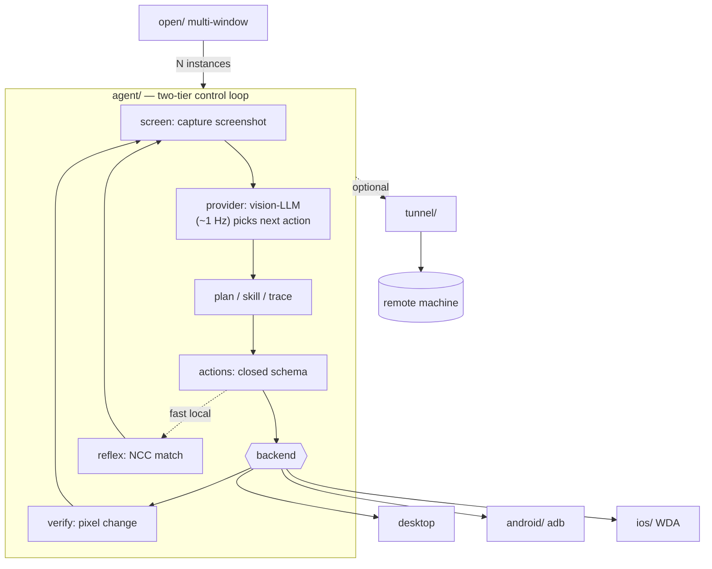

# secdogie

**An AI that can see your screen and use the mouse and keyboard — on a machine you own.**

Point it at a task in plain language. It screenshots the desktop, asks a vision model what to do next, and acts one step at a time. By default it shows a plan first and asks before every click.

Your API key stays on disk next to the program. Optional: route model traffic through a proxy (including TOR) or reach a remote machine over a tunnel you control.

---

## Windows: download the `.exe` (recommended)

No Python. No terminal required.

1. Open **[Releases](../../releases)** → download `secdogie-agent-windows-….exe`
2. Double-click it
3. If it’s the first run, paste any vision-model API key (Anthropic, OpenAI, DeepSeek, Groq, custom…)
4. Pick **Do a task** or **Preview only (safe)**
5. Use an example task or type your own — it asks before each step

Key and config are saved next to the `.exe` so the whole folder is portable.

**Build from source (one command from repo root):**

```powershell
.\build-agent.ps1
# → agent\packaging\dist\secdogie-agent.exe
```

---

## 60-second start (any platform)

```sh
cd agent && python3 -m venv .venv && source .venv/bin/activate && pip install -e .

# GUI: menu + task box + example tasks (same flow as the Windows exe)
secdogie-agent --menu
# or
secdogie-agent --gui

# Terminal: dry-run first, then real actions with y/N each step
secdogie-agent "open a text editor and type hello world" --dry-run
secdogie-agent "open a text editor and type hello world"
```

Full walkthrough (desktop, phone, multi-window, remote): **[`TUTORIAL.md`](TUTORIAL.md)**.

---

## What it is / isn’t

| It is | It isn’t |
|-------|----------|
| A vision-model loop that drives **real GUI** (apps without APIs) | A chat bot that only answers questions |
| Single-file / portable on Windows | A hosted cloud service |
| Operator-owned machines only | Multi-tenant or unattended SaaS |
| Optional self-built encrypted tunnel | Dependent on Tailscale / Cloudflare Tunnel |

**Only run it against computers (or phones) you own or are explicitly authorized to control.**

Start with **Preview only** / `--dry-run`. Keep per-step confirmation on until you trust a task. Nothing here has been independently security-audited — see [`SECURITY.md`](SECURITY.md).

---

## Downloads

Pre-built binaries for `agent`, `android`, `ios`, `open`, and `scene3d` (Linux, Windows, macOS) plus `secdogie-tunnel` (Linux) are on the **[Releases](../../releases)** page — bare executable or `.zip` with docs. Built automatically on `v*` / `V*` tags; see [`docs/RELEASING.md`](docs/RELEASING.md).

---

## Components

Small, composable pieces. Use only what you need.

| Piece | Role |
|-------|------|
| [`agent/`](agent/) | Vision-LLM computer-control loop (desktop) |
| [`open/`](open/) | Local web UI: one agent instance per selected window |
| [`fleet/`](fleet/) | One agent per isolated desktop (VM/session), true parallelism |
| [`android/`](android/) | Same loop over `adb` (nothing installed on the phone) |
| [`ios/`](ios/) | Same loop over [WebDriverAgent](https://github.com/appium/WebDriverAgent) |
| [`tunnel/`](tunnel/) | From-scratch encrypted VPN (C + libsodium): point-to-point + hub mode |
| [`scene3d/`](scene3d/) | Multi-model 3D scene analysis (per-view workers + aggregator) |
| Game stack (`aim/`, `carjack`, `gta/`, `commander/`, `handoff/`) | Single-player game helpers — see install below |

### How they fit together

`agent/` only needs a screen and input device — usually the machine it runs on. To control a *different* machine, put `secdogie-tunnel` between them (or run the agent on the remote box and use the tunnel for access). Tunnel and agent are independent on purpose.

Architecture sketch:



---

## Game stack (optional)

Packages live in-repo and aren’t on PyPI as a single install. One command sets up the venv in order:

```sh
./install.sh            # Linux/macOS   (--yolo, --all)
```
```powershell
.\install.ps1           # Windows       (-Yolo / -All)
```

Example (single-player only):

```sh
secdogie-carjack --weights yolov8n.pt --label car --enter-key f
```

You still need a GPU for real-time YOLO, the game itself, and (for GTA V) ScriptHookV.

---

## Layout

```
tunnel/    C, libsodium VPN (see PROTOCOL.md)
agent/     vision-LLM computer-control agent
open/      multi-window local web UI
fleet/     one agent per isolated desktop
android/   phone control via adb
ios/       phone/tablet control via WebDriverAgent
scene3d/   multi-model 3D scene analysis
handoff/   input-ownership baton (game stack)
aim/       real-time aim helper
commander/ tactician state machine
gta/       GTA V single-player bridge
```

Each subdirectory has its own README, tests, and limitations.

---

## Development

Every push/PR runs [`.github/workflows/test.yml`](.github/workflows/test.yml): Python `pytest` (headless), tunnel `ctest`, and `ruff`.

```sh
pip install ruff
ruff check .
cd agent && pip install -e . pytest && pytest tests/ -q
```

Shared loop, providers, and CLI flags live under `agent/secdogie_agent/` and are reused by `android` and `ios`.
