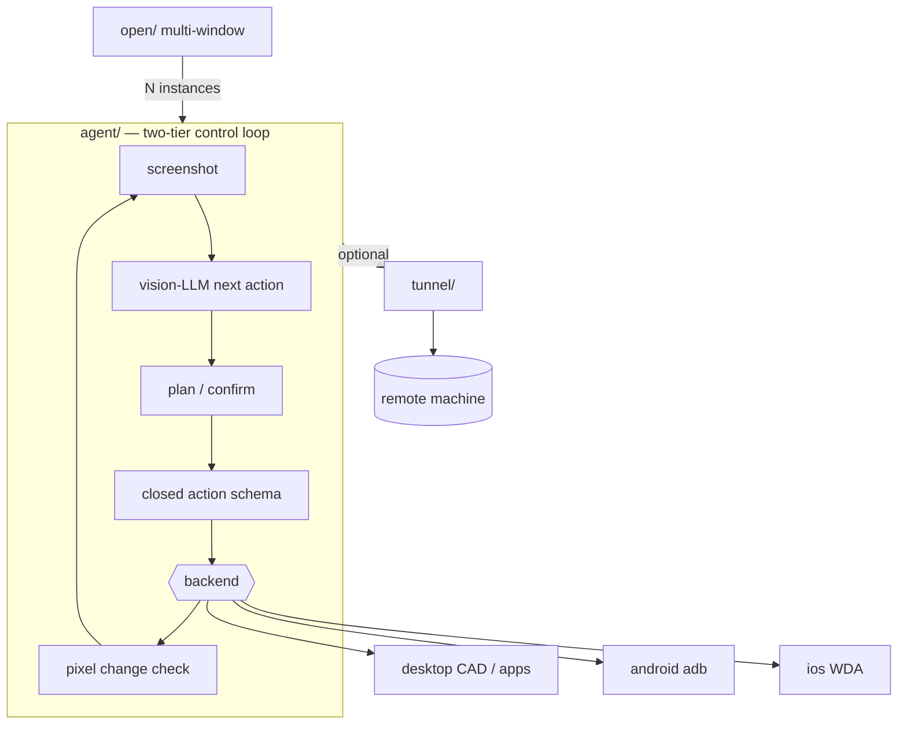

# secdogie

**Experimental.** A vision model that can see your screen and drive the mouse and keyboard — aimed at **CAD viewing/editing and other professional desktop apps** that have weak or no APIs.

This is **not production software**. No security audit, no warranty, operator-owned machines only. Use Preview / dry-run first; keep per-step confirmation on when changing drawings or files.

Point it at a task in plain language. It screenshots the desktop, asks a vision model what to do next, and acts one step at a time. By default it shows a plan first and asks before every click. Your API key stays on disk next to the program.

---

## Who this is for (right now)

| Fit | Why |
|-----|-----|
| Open a drawing, zoom, pan, read a dimension, export PDF | Real GUI, not an API wrapper |
| Apps where plugins are missing, locked, or too heavy | Pixel + accessibility clicks |
| You stay at the machine and approve steps | Confirmation is the safety model |

| Not a fit yet | Why |
|---------------|-----|
| Unattended batch on production vaults | No hardened policy engine |
| Multi-user / SaaS | Single-operator trust model |
| “Install and forget” commercial CAD AI | Still experimental |

Game-control helpers exist in-repo for experiments; they are **not** the product focus.

---

## Windows: download the `.exe`

No Python. No terminal required.

1. Open **[Releases](../../releases)** → download `secdogie-agent-windows-….exe`
2. Double-click it
3. First run: paste any vision-model API key (Anthropic, OpenAI, DeepSeek, Groq, custom…)
4. Prefer **Preview only (safe)** or **Smarter clicks** before real edits
5. Type a CAD-style task (or use an example) — it asks before each step

Key and config are saved next to the `.exe` (portable folder).

```powershell
.\build-agent.ps1
# → agent\packaging\dist\secdogie-agent.exe
```

---

## 60-second start (any platform)

```sh
cd agent && python3 -m venv .venv && source .venv/bin/activate && pip install -e .

secdogie-agent --menu          # same flow as the Windows exe
secdogie-agent --gui           # task box + examples

# Terminal: always dry-run first on real drawings
secdogie-agent "In the open CAD window, zoom extents and read the overall width dimension" --dry-run
secdogie-agent "In the open CAD window, zoom extents and read the overall width dimension"
```

Tip: leave the target CAD / viewer already open and focused. Pin with `--window "partial title"` when several apps are up. `--desktop-ax` uses the OS accessibility tree when the app exposes it (often steadier than pure pixels).

Full walkthrough: **[`TUTORIAL.md`](TUTORIAL.md)**.

---

## Example tasks (CAD-oriented)

These are prompts, not guarantees — success depends on the app UI and model:

- *In the already-open drawing viewer, zoom to fit and scroll so the title block is visible.*
- *Read the overall length dimension shown on the main view and type it into Notepad.*
- *Export or Save As PDF to the Desktop; do not overwrite without asking.*
- *Turn off the layer named HATCH if the layer list is visible; otherwise stop and ask.*

Start with **Preview only**. Never point `--auto` at drawings you cannot afford to damage.

---

## What it is / isn’t

| It is | It isn’t |
|-------|----------|
| A vision loop on **real GUI** (CAD, viewers, office apps without APIs) | A native CAD plugin or DWG parser |
| Step-confirmed, local-first | Unattended production automation |
| Single-file Windows agent + optional tunnel | A hosted cloud CAD service |
| Experimental toolkit | A commercial, supported product |

**Only run it against computers you own or are explicitly authorized to control.** See [`SECURITY.md`](SECURITY.md).

---

## Downloads

Pre-built binaries for `agent`, `android`, `ios`, `open`, and `scene3d` (Linux, Windows, macOS) plus `secdogie-tunnel` (Linux) are on **[Releases](../../releases)**. Built on `v*` / `V*` tags — [`docs/RELEASING.md`](docs/RELEASING.md).

---

## Components

| Piece | Role |
|-------|------|
| [`agent/`](agent/) | Vision-LLM desktop control loop (**main path for CAD/desktop**) |
| [`open/`](open/) | Local web UI: one agent per selected window |
| [`fleet/`](fleet/) | One agent per isolated desktop (VM/session) |
| [`tunnel/`](tunnel/) | From-scratch encrypted VPN (C + libsodium) |
| [`android/`](android/) / [`ios/`](ios/) | Same loop on phones (secondary) |
| [`scene3d/`](scene3d/) | Multi-model 3D view aggregation |
| Game stack (`aim/`, `gta/`, …) | Experimental only — not the product focus |

`agent/` drives whatever is on screen. Tunnel is optional for a remote box you already control.



---

## Optional extras

**Game stack** (experiments only):

```sh
./install.sh            # Linux/macOS   (--yolo, --all)
.\install.ps1           # Windows
```

**Layout**

```
agent/     main: vision computer-control (CAD/desktop)
open/      multi-window UI
fleet/     isolated desktops
tunnel/    libsodium VPN
android/ ios/ scene3d/
aim/ commander/ gta/ handoff/   experimental game helpers
```

---

## Development

```sh
pip install ruff && ruff check .
cd agent && pip install -e . pytest && pytest tests/ -q
```

CI: [`.github/workflows/test.yml`](.github/workflows/test.yml).
